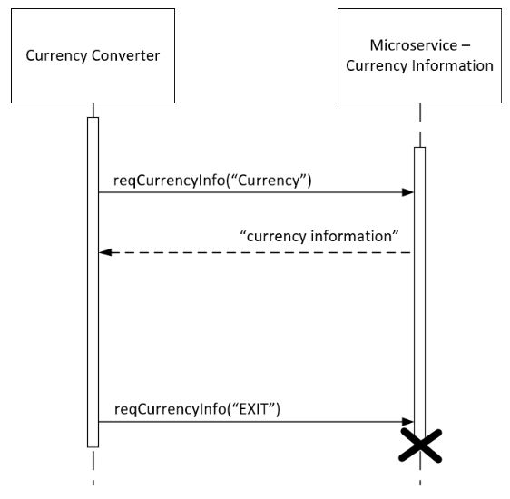

# microservice-CurrencyInfo
## Microservice to Currency Converter Application

The microservice_CurrencyInfo.py program is a microservice that provides information on a requested currency.
This microservice is intended to communicate with a Currency Converter application via a socket connection.

### Communication Pipeline:
Socket

### How to Run:

Required data library imports are: import socket, import time, import sys

Prior to launching, ensure that the Currency Converter application and the microservice are both configured to connect and communicate over the same host and port. The microservice is currently configured to connect to host='localhost' port=1234. Update these parameters as needed to ensure socket commmunication
is set up correctly.

The Currency Converter application should be launched first. The Currency Converter application should set up a socket connection and listen for the microservice. The microservice should be launched after the Currency Converter application has established a socket connection. After the microservice is launched, it will connect to the socket provided by the Currency Converter application and is ready to receive requests from the app immediately.

#### Start Sequence
1. Launch Currency Converter application - sets up socket
2. Launch Microservice - connects to socket on start up
3. Microservice is ready to receive requests immediately

### How to Make a Request to the Microservice:
Once the Currency Converter application and microservice are connected to the socket, the Currency Converter application may send requests to the microservice to get information about a specific currency. The Currency Converter application may request a currency's information by sending an encoded message over the socket which contains the currency code as a string. 

Pseudocode request call from app:
```
reqCurrencyInfo("Currency Code")
```

An example request call is provided below (python):
```
message = "USD"
conn.send(message.encode())
```

### How to Receive Data from the Microservice: 
The microservice will receive the request and send back an encoded message which contains the currency information as a string. The Currency Converter application should receive the message over the socket connection and decode it to access the currency information. 

Microservice responds with currency information as a string:
```
message = "currency information" 
```

An example receive call by the Currency Converter application is provided below (python):
```
message = conn.recv(1024)
message = message.decode()
```

If the Currency Converter application requests information for a currency that the microservice has no data, the microservice will return the message "No information available" to the Currency Converter application.

### UML Sequence Diagram:
A UML sequence diagram is provided to describe the communication between the Currency Converter application and the microservice.
In the diagram, the reqCurrencyInfo() function represents the request call (provided earlier) and sends the encoded message containing the name of the currency as a string.
The microservice sends back an encoded message with the currency information as a string.
The Currency Converter application may send an encoded message with the text string "EXIT" to close the microservice connection.


### Simulation provided:
A simulated Currency Converter application is provided in this repository to test socket communication.
The simulated Currency Converter app sets up the socket connection and listens for the microservice.
The microservice connects to the socket and sends the microservice name.
The simulated Currency Converter app can send requests to the microservice which will respond.

How to Run Simulation:
1. Start Currency_Converter_Simulatory.py
2. Start microservice_CurrencyInfo.py
3. Send requests from Currency_Converter_Simulator.py to get currency information
4. Type EXIT to close simulator and microservice
